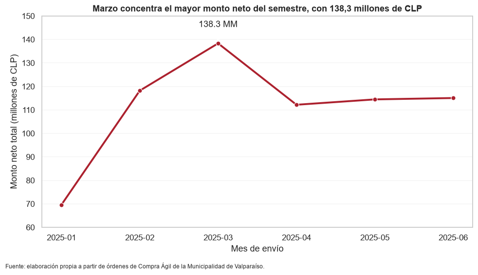
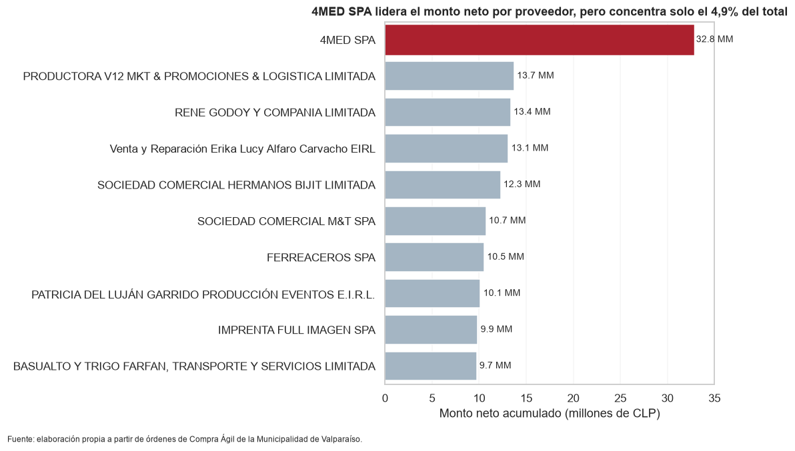
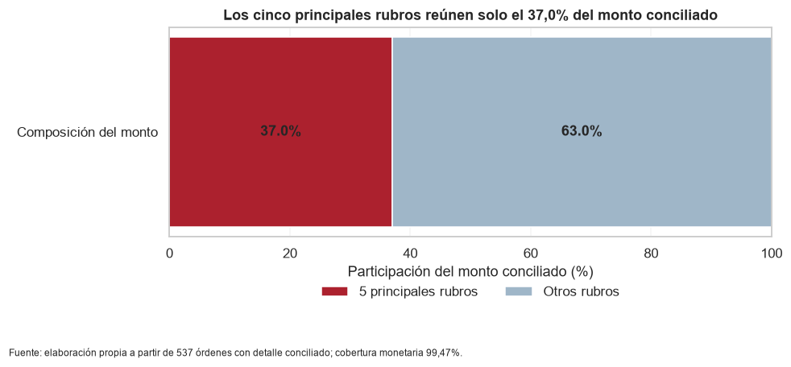

# Informe Sumativa 3 / Fase 4 — Grupo 7

Versión para revisión del equipo, 3 de octubre de 2026. Texto correspondiente al informe institucional de 10 páginas. La portada y el índice automático se encuentran en la versión Word/PDF. Los pendientes de la entrega se declaran en los apartados 15, 27 y 28.

## 1. Portada e índice

Universidad Andrés Bello · MCDI500 · Grupo 7: Jorge Guaico, Benjamín Araya, Alan Cañete y Patricio Cortez. Portada institucional e índice automático incluidos en Word/PDF.

## 2. Introducción y contextualización

El proyecto estudia las órdenes de Compra Ágil de la unidad de Abastecimiento de la Municipalidad de Valparaíso durante enero–junio de 2025. La exportación contiene 11.177 filas y 63 columnas, pero solo 541 órdenes: combina cabeceras, ítems y cotizaciones. Sumar todas las filas multiplicaría importes y distorsionaría los resultados.

Describir cómo se reparten los montos puede apoyar a la unidad de Abastecimiento en la revisión de su actividad mensual y de las categorías adquiridas. La preparación de F1–F2 estableció una base comparable; F3 verificó el núcleo algorítmico y su eficiencia; F4 organiza los hallazgos y responde la pregunta inicial. Esta continuidad sigue el enfoque integrador de la guía docente (Universidad Andrés Bello, 2026c).

## 3. Definición de la problemática y objetivos

Pregunta central: ¿Cómo se distribuyen los montos netos de las órdenes de Compra Ágil de la unidad de Abastecimiento de la Municipalidad de Valparaíso según proveedor, rubro y mes de envío, durante enero–junio de 2025?

Objetivo general: describir esa distribución mediante agregados reproducibles y visualizaciones interpretables. Se explicita el propósito analítico del proyecto, manteniendo los objetivos técnicos de preparación y validación de las entregas anteriores como medios para alcanzarlo.

Objetivos específicos: comparar los montos por mes; identificar la participación de los proveedores; y describir la composición monetaria por rubro sin duplicar importes de una misma orden.

Alcance: 540 órdenes Aceptada o Recepcion Conforme para mes y proveedor; 537 con detalle conciliado para rubro N1. Restricciones: un semestre, una unidad municipal y tres excepciones de detalle. Supuestos: atributos de cabecera consistentes por código, neto CLP informado por la fuente como medida común y firmas de ítem como reconstrucción operativa. No se estiman pagos, ejecución presupuestaria, causalidad ni estacionalidad anual.

## 4. Aplicación de herramientas científicas

pandas permite leer, validar y agrupar tablas; NumPy apoya cálculos numéricos; Matplotlib y seaborn construyen las figuras. Jupyter reúne código, salidas e interpretación, mientras Git/GitHub conserva la evolución. Las agrupaciones siguen la interfaz groupby de pandas (The pandas development team, s. f.). No se entrena un modelo predictivo.

## 5. Reproducibilidad técnica

Las evidencias F2–F3 registran Windows, Python 3.13.15, pandas 3.0.5 y NumPy 2.5.3; el notebook F4 registra Python 3.13.0. Son ejecuciones distintas y no un único entorno. requirements.txt y los registros de evidencias documentan dependencias; F4 conserva 14 celdas consecutivas sin errores. Falta adjuntar un registro completo de paquetes y kernel de esa ejecución.

## 6. Control de versiones

F4 está en f4-integracion-jorge, con el PR #4 abierto al 3 de octubre de 2026. Los commits 53a208e y bda4063 incorporan análisis y documentación; 0378105 restaura notebooks anteriores. El PR contiene tres archivos y no modifica módulos F1–F3. Su integración en main sigue pendiente.

## 7. Documentación del proceso

docs/bitacora_decisiones.md registra las políticas y validaciones. D31 define el universo F4; D32 limita la desagregación por rubro a órdenes conciliadas; D33 justifica los tres tipos de gráfico. Las decisiones conservan el original, no imputan atributos desconocidos y mantienen las excepciones. El apartado 27 vincula las mejoras con evidencia y distingue los pendientes.

## 8. Repositorio GitHub actualizado

Se conserva la organización del grupo: F1 para definición y procedencia, F2 para preparación, F3 para experimentación y arquitectura, y F4 para resultados. src, tests, docs, evidencias, scripts e informe mantienen sus funciones. Las tablas individuales de F2 se regeneran localmente; el original sí está versionado. El README aún contiene referencias desactualizadas a F4 proyectada.

Tabla 1. Aportes identificables en el historial y la bitácora

| Integrante | Evidencia del aporte |
| --- | --- |
| Benjamín Araya | Base F1–F2 y ampliación de pruebas/benchmark F3 (0ee1790). |
| Jorge Guaico | Formativa F3 (6eab21a), validación F2 (009b81d) e integración F4 (53a208e). |
| Alan Cañete | Datos y arquitectura POO, integrada por Patricio; actualización del informe (1efee3b). |
| Patricio Cortez | Validación e integración F2 (cf9ba6e) e integración POO/IQR F3 (ee55ee9). |

## 9. Diseño de soluciones algorítmicas eficientes

## 10. Codificación funcional

F2 separa lectura, perfilado, validación de cabeceras, conversiones, relaciones, diagnóstico y exportación. F3 mantiene carga, límites IQR y medición en módulos reutilizables. F4 importa ejecutar_pipeline, toma una copia de las órdenes habilitadas y genera agregados. Los nombres de variables y las salidas intermedias permiten seguir el flujo sin depender de cifras escritas manualmente.

## 11. Preprocesamiento y transformación del dataset

Se valida que los atributos de cabecera sean constantes dentro de codigoOC antes de construir una fila por orden. Se convierten fechas y decimales con control de errores, se normalizan identificadores y se conserva el neto en CLP provisto por la fuente. Los 139 faltantes de actividad y ocho de región se documentan; los 61 extremos IQR permanecen. La vista transformada se mantiene separada de los datos monetarios interpretables.

## 12. Validación técnica y verificación del código

F2 registra 18 pruebas y F3, 24: casos normales, límites, números inválidos, fechas imposibles y equivalencia de filtros. F3 reproduce 541 órdenes y 61 extremos. F4 verifica estados, excepciones, cobertura y diferencia monetaria. Se citan evidencias previas y salidas guardadas; no son nuevas pruebas ejecutadas al redactar.

## 13. Eficiencia y optimización

F3 compara filtros equivalentes con perf_counter, 1.000 llamadas y tres repeticiones; separa tiempo y memoria, incorpora calentamiento y alterna métodos. El contador mide duraciones breves (Python Software Foundation, s. f.-b). Se reporta el mínimo por llamada y la mediana del pico rastreado.

Tabla 2. Evidencia de eficiencia de la ejecución registrada de F3

| n | Bucle µs | pandas µs | Pico bucle B | Pico pandas B |
| --- | --- | --- | --- | --- |
| 541 | 49,56 | 167,43 | 2.416 | 7.866 |
| 2.000 | 188,20 | 176,48 | 7.816 | 17.437 |
| 50.000 | 4.776,56 | 343,24 | 182.976 | 325.289 |

Ambos filtros son O(n). El bucle gana en 541 y 1.000 valores; pandas desde 2.000, por lo que el cambio se acota entre 1.000 y 2.000. Los tamaños mayores son réplicas de carga, no nuevas órdenes. El pico de tracemalloc corresponde a asignaciones rastreadas, no a toda la RAM del proceso (Python Software Foundation, s. f.-c). El umbral depende del equipo.

## 14. Diseño estructurado del código

La división funcional separa preparación, criterio estadístico, medición y presentación. La serie IQR es plana, con límites conocidos; se conserva el recorrido iterativo. La recursividad se reevaluaría si el problema exigiera explorar profundidad variable (Universidad Andrés Bello, 2026a).

## 15. Notebook final ejecutado y documentado

F4 conserva 14 celdas ejecutadas y el notebook integrado de F3, 11. El cuaderno histórico POO mantiene contadores 4, 5, 8 y una celda vacía; F1–F2 también conservan celdas finales vacías tras la reversión. Son observaciones docentes pendientes.

## 16. Implementación de código modular y robusto

## 17. Programación orientada a objetos

F3 organiza coordinación, transformación, métricas y exportación en clases. EstrategiaFaltantes y sus tres subclases muestran herencia; la llamada común evaluar permite polimorfismo. Los atributos de configuración y los métodos encapsulan responsabilidades (Python Software Foundation, s. f.-a). Las estrategias comparan consecuencias; no ejecutan imputaciones por llamarse así.

## 18. Documentación de arquitectura

arquitectura.md documenta PipelineCompraAgil, TransformadorDatos, GeneradorMetricas y ExportadorResultados. Strategy permite intercambiar políticas sin condicionales fijas en el coordinador. El núcleo IQR permanece funcional porque no requiere estado. El módulo y el notebook integrado evidencian clases; el cuaderno histórico POO no acredita ejecución completa.

## 19. Construcción de visualizaciones efectivas

## 20. Preprocesamiento y transformación de datos

F4 reutiliza F2 y conserva categorías y CLP originales. Para rubros lee el detalle, aplica la firma de ítem de F2 y agrega MontoNetoItemCLP de órdenes habilitadas conciliadas a 1 CLP. No multiplica cabeceras entre rubros ni grafica la matriz escalada.

## 21. Visualizaciones analíticas

Las figuras responden a los tres objetivos: evolución mensual con línea, comparación de proveedores con barras horizontales y composición por rubro con barra apilada al 100%. La elección y el rotulado siguen el apunte F4 (Universidad Andrés Bello, 2026b). Se reproducen las imágenes guardadas en el notebook, sin recalcular resultados.

Figura 1. Evolución mensual del monto neto habilitado

Marzo alcanza 138,3 millones de CLP (20,71%) y enero registra el menor monto. Mayo tiene 114 órdenes frente a 100 en marzo, pero acumula menos dinero. La frecuencia no determina por sí sola el monto mensual. Límite: seis meses de órdenes, sin inferencia de estacionalidad. El eje vertical comienza en 60 millones para mostrar la variación.

Tabla 3. Órdenes y montos mensuales del universo principal

| Mes de 2025 | Órdenes | Monto neto CLP | Participación % |
| --- | --- | --- | --- |
| Enero | 56 | 69.577.225 | 10,42 |
| Febrero | 77 | 118.183.917 | 17,70 |
| Marzo | 100 | 138.321.637 | 20,71 |
| Abril | 96 | 112.183.971 | 16,80 |
| Mayo | 114 | 114.467.815 | 17,14 |
| Junio | 97 | 115.050.552 | 17,23 |

Nota. Elaboración propia desde las salidas F4. Los montos mensuales se redondean a CLP; su suma puede diferir del total redondeado. Las participaciones usan los montos antes de ese redondeo.

Figura 2. Diez proveedores con mayor monto neto acumulado

4MED SPA lidera con 32,8 millones de CLP y 4,91%. Los diez primeros reúnen 20,41% en la salida del notebook: no concentran la mayor parte del total. Límite: se compara monto de órdenes, sin evaluar dependencia contractual, desempeño ni pagos efectivos.

Figura 3. Composición del monto conciliado por rubro N1

Los cinco principales rubros reúnen 36,98% y los demás 63,02%, según los acumulados mostrados por F4. La composición se distribuye entre múltiples categorías. Límite: el denominador es 664.257.301 CLP de 537 órdenes; no el total principal de 540 órdenes.

Nota de precisión. Los acumulados 20,41%, 36,98% y 63,02% suman participaciones individuales ya redondeadas. El cociente directo entre montos acumulados y sus respectivos totales da aproximadamente 20,40%, 36,97% y 63,03%. Se conserva la salida validada y se declara esta diferencia de redondeo; los hallazgos no cambian.

## 22. Metodología del desarrollo técnico

F1 define pregunta y procedencia; F2 genera tablas verificadas; F3 compara filtros IQR y organiza clases; F4 comunica los resultados. El notebook final reutiliza el pipeline F2 y se apoya en las validaciones previas de F3; no ejecuta su suite ni crea un módulo de limpieza paralelo.

El flujo es: original → verificación y proyección por codigoOC → neto CLP y estados → 540 órdenes habilitadas → agregación por mes/proveedor. Para rubros: detalle → firmas de ítem → 537 órdenes habilitadas conciliadas → agregación monetaria N1. Cada tabla antecede a su figura. La orden cancelada y las tres excepciones permanecen trazables; ninguna se corrige por imputación.

## 23. Validación y reflexión técnica

La comparación entre fases distingue denominadores: F2–F3 estudian las 541 órdenes y los 61 extremos; F4 restringe los agregados por estado y, para rubros, por conciliación. La diferencia agregada entre cabecera y detalle seleccionado se muestra como 0,00 CLP; el criterio por orden admite 1 CLP. La selección de algoritmos depende de evidencia temporal y espacial, y la validación debe repetirse al cambiar datos o código.

Samuel y Mietchen (2024) muestran que publicar notebooks y dependencias no asegura reproducibilidad. Se conservan salidas, pruebas y registros de entorno y se declaran los artefactos pendientes. Ejecutar correctamente no equivale a verificar de manera independiente la fuente.

## 24. Resultados

El universo principal suma 667.785.115 CLP, redondeado, en 540 órdenes: 537 Aceptada y tres Recepcion Conforme. Una orden con Solicitud de Cancelacion queda fuera del agregado. Marzo reúne el mayor monto; 4MED SPA es el proveedor principal. Para rubros, las 537 órdenes seleccionadas cubren 99,47% del monto principal y reconstruyen 664.257.301 CLP. Se excluyen solo de esa desagregación 2427-264-AG25, 2427-511-AG25 y 2427-543-AG25, por un monto de cabecera de 3.527.814 CLP.

## 25. Discusión

El máximo temporal está en marzo y los montos se distribuyen entre numerosos proveedores y rubros. Los documentos previos no formulan una hipótesis causal; no se añade retrospectivamente. La expectativa técnica de que pandas sería siempre más rápido tampoco se confirma en entradas pequeñas.

El archivo representa una unidad y un semestre. La conciliación numérica no demuestra que cada firma corresponda a una línea real; las tres excepciones requieren contraste con la fuente. El filtro de estados y la exclusión por rubro condicionan la cobertura. Los porcentajes de cabecera y de detalle tienen denominadores distintos; confundirlos o interpretar montos como pagos sería un riesgo de lectura.

## 26. Conclusiones

Los montos netos alcanzan su máximo mensual en marzo. Por proveedor, ninguno reúne una parte mayoritaria; por rubro, los cinco primeros reúnen cerca del 37% conciliado. La preparación trazable permitió responder la pregunta sin multiplicar cabeceras. Como mejoras se propone contrastar las excepciones con la fuente, calcular acumulados antes de redondear y cerrar la ejecución/documentación de los cuadernos pendientes. Ampliar el período permitiría describir otros meses, sin atribuir causalidad a los cambios.

## 27. Trazabilidad de mejoras

La tabla distingue correcciones implementadas y observaciones todavía abiertas. Los commits corresponden al historial consultado; la revisión de este informe no implica una nueva ejecución ni modifica los informes ya entregados.

Tabla 4. Observaciones, acciones y evidencia de evolución

| Observación | Acción e impacto | Evidencia y estado |
| --- | --- | --- |
| Relevancia y objetivo analítico poco explícitos (F1–F2). | Apartados 2–3 explicitan destinatario, alcance y objetivos de análisis. | Este informe; versión del 3 de octubre de 2026. |
| Pruebas y eficiencia requerían mayor sustento (F3). | 24 pruebas, siete tamaños y medición separada de tiempo/memoria. | 0ee1790; benchmark_iqr.csv y F3/evidencias. |
| Incorporar y justificar POO. | Integración de clases y núcleo IQR; documentación de Strategy. | ee55ee9, 1c2a1ec; F3/src y arquitectura.md. |
| Asignación monetaria por rubro y excepciones abiertas. | Reconstrucción por ítems; 537 órdenes y cobertura 99,47%. | 53a208e; D31–D32. |
| Visualizaciones vinculadas a la pregunta. | Línea, barras horizontales y composición al 100%. | 53a208e, bda4063; D33. |
| Evolución, versión vigente y redacción poco claras. | Informe ordenado en 29 apartados; tabla de mejoras y corrección editorial. | Este informe. README y changelog aún por cerrar. |
| Celdas finales vacías y POO con ejecución parcial. | Pendiente: F1–F2 fueron restaurados; cuaderno POO histórico sigue incompleto. | 48eaf5d revertido por 0378105; apartado 15. |

D31–D33 registran decisiones de F4; aún falta consolidar un changelog con fechas, justificaciones y commits. Para cerrar la entrega también se debe integrar el PR, actualizar el README, resolver los cuadernos observados y comprobar que el video utiliza las mismas cifras. No se declaran completados estos pasos.

## 28. Presentación audiovisual

La presentación audiovisual está pendiente de grabación y de incorporación de su enlace en Canvas Studio. Se propone un guion de siete minutos, con apoyo de las tres figuras y participación de los cuatro integrantes, conforme a la guía (Universidad Andrés Bello, 2026c). La distribución es una propuesta, no evidencia de una grabación realizada.

| Tramo | Contenido y participación propuesta |
| --- | --- |
| 0:00–1:15 | Benjamín: equipo, pregunta, contexto y procedencia. |
| 1:15–2:45 | Alan: unidad de observación, preparación y arquitectura POO. |
| 2:45–4:00 | Patricio: validación, eficiencia y trazabilidad entre fases. |
| 4:00–7:00 | Jorge: tres hallazgos, límites y respuesta integrada; cierre del equipo. |

## 29. Bibliografía

Las fuentes docentes orientan la integración y la elección visual; la documentación oficial sustenta las operaciones utilizadas; el artículo académico fundamenta la cautela sobre reproducibilidad. Se citan en el cuerpo. Los materiales del curso son de acceso institucional y las páginas técnicas se consultaron el 3 de octubre de 2026.

Python Software Foundation. (s. f.-a). Classes. Python 3.13 documentation. Recuperado el 3 de octubre de 2026, de [https://docs.python.org/3.13/tutorial/classes.html](https://docs.python.org/3.13/tutorial/classes.html)

Python Software Foundation. (s. f.-b). time — Time access and conversions. Python 3.13 documentation. Recuperado el 3 de octubre de 2026, de [https://docs.python.org/3.13/library/time.html](https://docs.python.org/3.13/library/time.html)

Python Software Foundation. (s. f.-c). tracemalloc — Trace memory allocations. Python 3.13 documentation. Recuperado el 3 de octubre de 2026, de [https://docs.python.org/3.13/library/tracemalloc.html](https://docs.python.org/3.13/library/tracemalloc.html)

Samuel, S., & Mietchen, D. (2024). Computational reproducibility of Jupyter notebooks from biomedical publications. GigaScience, 13, artículo giad113. [https://doi.org/10.1093/gigascience/giad113](https://doi.org/10.1093/gigascience/giad113)

The pandas development team. (s. f.). pandas.DataFrame.groupby. pandas documentation. Recuperado el 3 de octubre de 2026, de [https://pandas.pydata.org/docs/reference/api/pandas.DataFrame.groupby.html](https://pandas.pydata.org/docs/reference/api/pandas.DataFrame.groupby.html)

Universidad Andrés Bello. (2026a). Apunte de la Fase 3: Núcleo algorítmico, eficiencia y programación orientada a objetos [Material del curso MCDI500; MCDI500_Apunte_Fase3.pdf]. Canvas. [https://canvas.unab.cl/courses/239155](https://canvas.unab.cl/courses/239155)

Universidad Andrés Bello. (2026b). Apunte de la Fase 4: Visualización y comunicación de los resultados [Material del curso MCDI500; MCDI500_Apunte_Fase4.pdf]. Canvas. [https://canvas.unab.cl/courses/239155](https://canvas.unab.cl/courses/239155)

Universidad Andrés Bello. (2026c). Guía de desarrollo · Sumativa 3 (Fase 4): Proyecto final integrador: análisis, reproducibilidad y comunicación de resultados [Material del curso MCDI500; Guia_apoyo_Sumativa3_Fase4.docx]. Canvas. [https://canvas.unab.cl/courses/239155](https://canvas.unab.cl/courses/239155)

Fuente de resultados del grupo: notebook F4 adjunto y PR #4, commit 0378105; salidas y evidencias F2–F3 de ese árbol. Los informes anteriores se usan como antecedentes del desarrollo, sin sustituir la comprobación del código ni atribuir al informe una ejecución nueva.

[Repositorio del Grupo 7](https://github.com/BenjaArayaM/proyecto-grupo7-mcdi500) · [PR de integración F4](https://github.com/BenjaArayaM/proyecto-grupo7-mcdi500/pull/4)
